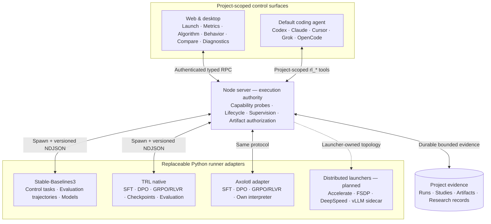

# t3rl

**An open, agent-assisted workspace for reinforcement learning and LLM post-training research.**

t3RL brings experiment execution, live evidence, run comparison, diagnostics, and coding agents
into one desktop workspace. It builds on [T3 Code](https://github.com/pingdotgg/t3code), preserving
its fast, remote-ready agent interface while adding a project-scoped RL Lab backed by Python,
Gymnasium, Stable-Baselines3, TRL, and Axolotl adapters for bounded LLM post-training.

> [!WARNING]
> t3RL is alpha software. The current release is intended for local research and development, not
> unattended or production training workloads.

## What t3rl does

- Runs RL experiments on the server attached to a project, so training continues if the desktop or
  browser client disconnects.
- Streams bounded lifecycle and metric updates without placing high-volume telemetry in the agent
  conversation.
- Records the resolved seed, configuration, source revision, Python environment, runner version,
  metrics, and artifacts for each run.
- Replays evaluation trajectories step by step and exposes observations, actions, rewards, and
  episode boundaries; LLM runs reuse the same bounded view for prompts, completions, verifier
  decisions, and rewards.
- Compares compatible runs across seeds while surfacing configuration, source, and environment
  drift.
- Schedules multi-seed studies and compares verified held-out samples with explicit statistical
  units, confidence intervals, failed or unmatched runs, and evaluation protocols.
- Saves verified checkpoints and adapter artifacts with content identity and lineage, then supports
  trainer-state resume and compatible warm-start flows.
- Loads project-owned experiment definitions from `.t3rl/experiments/` while snapshotting local
  datasets, verifiers, and definitions into each run.
- Retains immutable research records and exports selected evidence with hashes, declared omissions,
  and a standalone verifier that works without the originating database.
- Provides explainable diagnostic signals for return collapse, non-finite values, excessive KL,
  low entropy, divergent value loss, stalled streams, and train/evaluation gaps.
- Explores retained metrics as a chart, bounded data table, or declarative source, and explains the
  resolved algorithm through a conceptual stage visualizer.
- Adds reusable research specialists and a review-gated Autoresearch workflow that prepares one
  falsifiable iteration at a time.
- Gives Codex, Claude Code, Cursor, Grok, and OpenCode project-scoped tools for inspecting RL
  evidence and, with the active permission mode, starting or cancelling runs.

## What's new in v0.0.35

This alpha release strengthens the evidence behind the local post-training workflow:

- Study comparisons use verified per-sample evaluation artifacts. Estimator version 2 reports the
  effective statistical unit, exclusions, and insufficient evidence, with bounded computation.
- Checkpoint children preserve their parent's seed roles, frozen evaluation protocol, and input
  identity. Resume checks compare input content across each run's separate snapshot directory.
- Immutable research records connect hypotheses, evidence, proposed changes, outcomes, and
  limitations through project-scoped agent tools.
- Evidence exports retain available source snapshots, environment setup files, evaluation samples,
  and selected artifacts. A standalone Python verifier checks included bytes and reports omissions;
  web/desktop provides a signed download from the connected environment.
- Real TRL and Axolotl SFT/DPO checks exercise optimization, interruption, trainer-state resume,
  independent adapter loading, and held-out evaluation on the recorded CPU/CUDA paths.

The [v0.0.35 source release](https://github.com/Luisgarcav/t3rl/releases/tag/v0.0.35) is an alpha
prerelease. Build from source using the instructions below; it does not include desktop installers.

### What has been verified

The [framework report](./docs/benchmarks/rl-framework-validation/README.md) records fourteen
SFT/DPO lifecycle cases and a native TRL GRPO CUDA case on one Linux host. A separate
[service integration result](./docs/benchmarks/rl-post-training-validation/production-evidence-2026-09-05.json)
launches six CUDA SFT runs and one checkpoint child through the real server services, compares three
seed pairs, exports their evidence, and reloads all seven adapters offline after deleting the
originating project and database.

These are bounded integration results. The SFT/DPO fixture has a tiny model and two held-out
records; it does not establish useful model improvement. Clean-machine training reproduction, a
preregistered investigation, integrated client verification, and full-system performance remain
open acceptance criteria for the first local milestone, **Release A**.

## Mini roadmap

| Order                   | Next development                                                                                                                                                            | Completion evidence                                                                                    |
| ----------------------- | --------------------------------------------------------------------------------------------------------------------------------------------------------------------------- | ------------------------------------------------------------------------------------------------------ |
| 1 · Local research      | Complete one preregistered investigation with baseline, candidate, ablation, independent holdout, and at least three training seeds.                                        | An exported conclusion and limitations that another researcher can reproduce from a clean environment. |
| 2 · Product validation  | Exercise GPU study scheduling, finish the declared adapter checks, and verify web/desktop control, evidence downloads, and remote reconnect.                                | Integrated lifecycle results and measured server, WebSocket, memory, and renderer budgets.             |
| 3 · Training breadth    | Add RLOO, then a version-scoped PPO integration when the reference investigation needs them.                                                                                | Real training, evaluation, checkpoint, and resume evidence for each supported method.                  |
| 4 · Scale and operation | Add distributed launchers, FSDP/DeepSpeed, and supervised vLLM as capacity or throughput requires; then process recovery, advanced storage controls, and mobile monitoring. | Two-GPU and failure-recovery results, recoverable storage operations, and remote mobile verification.  |

The [development roadmap](./docs/internals/rl-lab-roadmap.md) and
[post-training plan](./docs/superpowers/plans/2026-09-04-serious-llm-post-training.md) track the full
scope and acceptance criteria. Expansion follows the local reference investigation; these are
priorities, not promised release dates.

## RL execution coverage

The bundled CPU runner uses `MlpPolicy` and ships with these experiments:

| Algorithm | Learning style                  | Action space | Bundled environment |
| --------- | ------------------------------- | ------------ | ------------------- |
| PPO       | On-policy actor-critic          | Discrete     | `CartPole-v1`       |
| A2C       | On-policy actor-critic          | Discrete     | `CartPole-v1`       |
| DQN       | Off-policy value-based          | Discrete     | `CartPole-v1`       |
| SAC       | Off-policy, entropy-regularized | Continuous   | `Pendulum-v1`       |
| TD3       | Off-policy actor-critic         | Continuous   | `Pendulum-v1`       |
| DDPG      | Off-policy actor-critic         | Continuous   | `Pendulum-v1`       |

Optional LLM post-training adapters implement these method families:

| Method | Runner support | Dataset contract                       | Evaluation claim    |
| ------ | -------------- | -------------------------------------- | ------------------- |
| SFT    | TRL, Axolotl   | Text or conversation                   | Held-out loss       |
| DPO    | TRL, Axolotl   | Prompt/chosen/rejected preference rows | Preference accuracy |
| GRPO   | TRL, Axolotl   | Prompt/reference RLVR rows             | Verifier pass rate  |

Recorded framework validation covers native TRL SFT/DPO on CPU and CUDA, Axolotl SFT/DPO on CUDA,
and native TRL GRPO on CUDA. Axolotl GRPO is implemented but remains unverified in this release's
real-framework matrix. Availability depends on the selected interpreter and method capabilities.

The bundled single-GPU GRPO preview includes these experiments:

| Algorithm | Reward regime                | Model                        | Bundled dataset      | Holdout resolution |
| --------- | ---------------------------- | ---------------------------- | -------------------- | ------------------ |
| GRPO      | RLVR, exact-integer verifier | `Qwen/Qwen2.5-0.5B-Instruct` | `arithmetic-rlvr-v1` | 8 samples          |
| GRPO      | RLVR, exact-integer verifier | `Qwen/Qwen2.5-0.5B-Instruct` | `arithmetic-rlvr-v2` | 256 samples        |

The `v1` dataset sits near the base model's ceiling, where a before/after comparison cannot resolve
an effect smaller than a single sampled generation. The `v2` dataset is drawn from a difficulty tier
a calibration run measured at a 0.427 base pass rate and evaluates a 64-row holdout four times, so
the measurement has headroom in both directions. Across 20 seeds of the untrained policy, that moved
the noise floor of a single evaluation from a standard deviation of 0.111 to 0.021, and no seed sat
at the ceiling. Both datasets are kept: a run's dataset SHA-256 records which one produced it.

The Axolotl adapter lives in its own environment named by `T3RL_PYTHON_AXOLOTL` because its
dependency constraints conflict with the native TRL runner. Both use the shared experiment and
evidence contracts. Cross-runner comparisons still require compatible evaluation protocols;
matching dataset names alone does not isolate a backend effect.

The workers record the resolved model commit, dataset SHA-256, split policy, verifier identity,
dependency fingerprint, execution backend, and token/wall-clock/GPU-hour limits. They evaluate a
versioned holdout before and after training, emit optimizer and resource metrics, and retain
bounded prompt/completion evidence plus a separate evaluation artifact. Checkpoint policy is
explicit and retained LoRA adapters carry verified base-model and source-checkpoint lineage. vLLM,
distributed scheduling, arbitrary unvalidated launch commands, and production-scale datasets are
not yet integrated.

The research catalog is intentionally broader than the execution catalog. It can help plan and
review work involving tabular RL, model-based RL, offline and imitation learning, multi-agent RL,
bandits, evolutionary methods, RLHF/RLAIF/RLVR, and LLM policy optimization. Execution currently
covers the table above; every other catalog method still needs an adapter. The UI reports this
distinction and does not claim that an unavailable runner is installed.

## Run the desktop app from source

### Prerequisites

- Git
- Node.js `24.13.1` or newer within the Node 24 release line
- [Vite+](https://viteplus.dev/) (`vp`)
- [uv](https://docs.astral.sh/uv/getting-started/installation/) for Python environments
- Python `3.10`–`3.13` for real RL runs (`uv` can install it on demand)
- At least one authenticated provider CLI if you also want to use the agent workspace

Install Vite+ on macOS or Linux:

```bash
curl -fsSL https://vite.plus | bash
```

On Windows PowerShell:

```powershell
irm https://vite.plus/ps1 | iex
```

### 1. Clone and install JavaScript dependencies

```bash
git clone https://github.com/Luisgarcav/t3rl.git
cd t3rl
vp i
```

### 2. Reproduce an optional RL runtime

The three runners use independent committed locks because their framework constraints can conflict.
Sync only the environments you need. On macOS or Linux:

```bash
uv sync --project python/environments/sb3 --locked
export T3RL_PYTHON_STABLE_BASELINES3="$PWD/python/environments/sb3/.venv/bin/python"
```

For the optional GRPO/RLVR experiments, reproduce TRL and Axolotl separately and use CUDA-capable
PyTorch runtimes:

```bash
uv sync --project python/environments/trl --locked
uv sync --project python/environments/axolotl --locked
export T3RL_PYTHON_TRL="$PWD/python/environments/trl/.venv/bin/python"
export T3RL_PYTHON_AXOLOTL="$PWD/python/environments/axolotl/.venv/bin/python"
"$T3RL_PYTHON_TRL" -c 'import torch; assert torch.cuda.is_available()'
"$T3RL_PYTHON_AXOLOTL" -c 'import torch; assert torch.cuda.is_available()'
```

On Windows PowerShell:

```powershell
uv sync --project python/environments/sb3 --locked
$env:T3RL_PYTHON_STABLE_BASELINES3 = (Resolve-Path .\python\environments\sb3\.venv\Scripts\python.exe).Path
```

Use the same `uv sync --project ... --locked` command and dedicated `T3RL_PYTHON_TRL` or
`T3RL_PYTHON_AXOLOTL` variable for an LLM environment. `uv lock --check --project <environment>`
verifies that a committed lock still matches its project metadata without changing it.

The Python environment is optional if you only want to open the app or use its agent features.
RL Lab checks capabilities when it opens and shows an actionable message instead of installing
packages automatically. When a selected interpreter belongs to one of these projects, run startup
also verifies its lock and records the lockfile SHA-256, Python, platform, framework, PyTorch, CUDA,
and driver evidence in the immutable manifest.

### 3. Launch Electron

Run this from the same terminal in which the selected `T3RL_PYTHON_*` variables are set:

```bash
vp run dev:desktop
```

This starts the Vite renderer and the Electron desktop host together. Development state is isolated
under this checkout's gitignored `.t3/` directory. Stop the process with `Ctrl+C`.

To build an installer for the current platform:

```bash
vp run dist:desktop:artifact
```

Platform-specific build commands are also available:

```bash
vp run dist:desktop:dmg    # macOS
vp run dist:desktop:linux  # Linux AppImage
vp run dist:desktop:win    # Windows NSIS installer
```

## Use RL Lab

1. Open or create a project in t3RL.
2. Select the flask button next to the project, or open an empty right panel and choose
   **Experiments**.
3. Confirm that the experiment's selected method is available on its `stable-baselines3`, `trl`, or
   `axolotl` runner.
4. Choose a bundled experiment, set an integer seed, and select **Start run**.
5. Use **Overview** for lifecycle, live metrics, manifests, cancellation, and artifacts; use
   **Data** to inspect raw metric observations and **Algorithm** to explore the resolved training
   flow.
6. Use **Behavior** to inspect evaluation trajectories or LLM prompt/completion verifier samples,
   **Compare** to aggregate compatible runs, and **Diagnostics** to review bounded heuristic
   findings.
7. From the right panel, use **Specialists** to prepare a reusable research role or
   **Autoresearch** to draft a budgeted, approval-gated iteration in the agent composer.
8. Once a run has stopped, select **Export evidence** to download a verified inventory and retained
   artifacts. See the [evidence guide](./docs/user/rl-evidence.md) for offline verification and
   agent-assisted exports that include studies, research records, or full checkpoints.

Every intentional rerun receives a new run ID. Reconnecting to an existing run resumes its live
view without duplicating metric points or artifacts.

## Use RL Lab with an agent

The default agent receives the product-native `t3-code` RL toolkit for the current project. The same
tools are available to every built-in provider without additional RL-specific configuration.

| Research task                                           | Agent tools                                                           |
| ------------------------------------------------------- | --------------------------------------------------------------------- |
| Check runners and experiments                           | `rl_capabilities`, `rl_validate_experiment`                           |
| Find and inspect retained runs                          | `rl_list_runs`, `rl_get_run`                                          |
| Explore metrics and diagnostics evidence                | `rl_query_metrics`                                                    |
| Create and inspect multi-seed studies                   | `rl_create_study`, `rl_get_study`                                     |
| Compare configurations, studies, and results            | `rl_compare_runs`, `rl_compare_study`                                 |
| Read logs, summaries, evaluations, and behavior replays | `rl_read_artifact`                                                    |
| Execute, resume, warm-start, or stop training           | `rl_start_run`, `rl_resume_run`, `rl_warm_start_run`, `rl_cancel_run` |
| Retain and inspect research records                     | `rl_record_research`, `rl_get_research_record`                        |
| Export selected runs, studies, and research evidence    | `rl_export_evidence`                                                  |

The server derives project scope from the agent's thread, so a tool call cannot select another
project. Metric responses and textual artifacts are bounded; binary models are not copied into the
agent context. Starting and cancelling training remain permission-aware actions. Disabling agent
browser access removes only the `preview_*` tools and does not disable the RL toolkit.

## Architecture



The server owns execution. The client renders authoritative state, and the Python worker stays
replaceable behind a small process protocol. This keeps local, desktop, and remote behavior aligned
without coupling the UI to a particular RL framework.

## Current limits

- Each run uses one training seed and one local worker process. Control experiments use CPU; the bundled
  GRPO preview requires one CUDA GPU. Studies combine separate runs and record the supported
  training, data, evaluation, and generation seed roles.
- Active runs are marked `interrupted` after a server restart. A verified compatible checkpoint can
  start a new child; automatic adoption of an existing worker process is still planned.
- Bundled experiments are intentionally small. Project-owned definitions extend the catalog within
  the supported method and dataset contracts; they are not arbitrary trainer launch commands.
- Checkpoints and LoRA adapters are retained according to explicit policy. Restoring trainer state
  and verifying artifact hashes do not guarantee identical results across hardware or frameworks.
- Sample-based study evidence is implemented for offline TRL/Axolotl evaluation. GRPO runs with
  only aggregate evaluation metrics report missing sample evidence for those comparisons.
- vLLM, distributed launchers, and production-scale training remain planned. The named lifecycle
  checks cover one host; clean-machine reproduction, GPU study scheduling, integrated client checks,
  and full-system performance budgets remain open.
- Evidence archives are bounded to 12 runs, 512 MiB of included evidence, and 4,096 files. Omitted
  dependencies or checkpoints remain explicit; archive integrity is separate from rerunning training.
- Diagnostics are inspection heuristics, not causal conclusions or universal RL thresholds.
- Autoresearch prepares a single reviewed iteration; it does not edit code, launch training, expand
  budgets, or loop autonomously without explicit approval.
- RL experiment authoring is currently centered on the web/desktop client.

## Documentation

- [RL Lab user guide](./docs/user/rl-lab.md)
- [Export and verify evidence](./docs/user/rl-evidence.md)
- [RL Lab architecture](./docs/internals/rl-lab.md)
- [Framework adapter architecture](./docs/internals/rl-framework-adapters.md)
- [Algorithm coverage](./docs/internals/rl-algorithm-coverage.md)
- [Development roadmap](./docs/internals/rl-lab-roadmap.md)
- [Post-training plan and delivery status](./docs/superpowers/plans/2026-09-04-serious-llm-post-training.md)
- [Install and first run](./docs/user/install.md)
- [Remote access](./docs/user/remote-access.md)
- [Contributor guide](./CONTRIBUTING.md)

## Project status and attribution

t3RL is an independent open-source fork of [T3 Code](https://github.com/pingdotgg/t3code). We are
grateful to its maintainers and contributors for the multi-surface agent platform on which this
research workspace is built.

Licensed under the [MIT License](./LICENSE).
