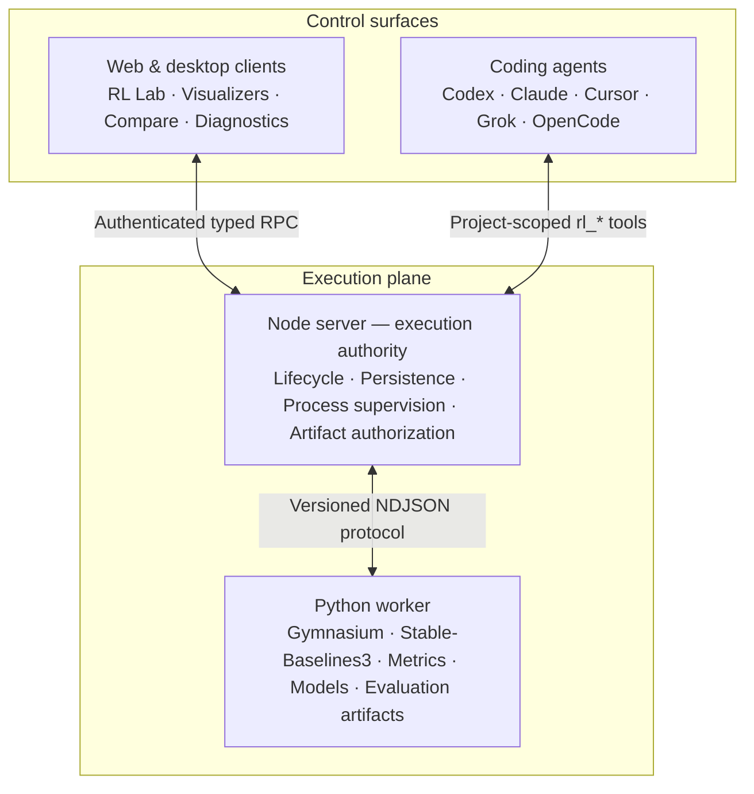

# t3rl

**An open, agent-assisted control plane for reproducible reinforcement learning research.**

t3RL brings experiment execution, live evidence, run comparison, diagnostics, and coding agents
into one desktop workspace. It builds on [T3 Code](https://github.com/pingdotgg/t3code), preserving
its fast, remote-ready agent interface while adding a project-scoped RL Lab backed by Python,
Gymnasium, and Stable-Baselines3.

> [!WARNING]
> t3RL is alpha software. The current release is intended for local research and development, not
> unattended or production training workloads.

## What t3rl does

- Runs RL experiments on the server attached to a project, so training continues if the desktop or
  browser client disconnects.
- Streams bounded lifecycle and metric updates without placing high-volume telemetry in the agent
  conversation.
- Records the resolved seed, configuration, source revision, Python environment, runner version,
  metrics, and artifacts for each run.
- Replays evaluation trajectories step by step and exposes observations, actions, rewards, and
  episode boundaries.
- Compares compatible runs across seeds while surfacing configuration, source, and environment
  drift.
- Provides explainable diagnostic signals for return collapse, non-finite values, excessive KL,
  low entropy, divergent value loss, stalled streams, and train/evaluation gaps.
- Explores retained metrics as a chart, bounded data table, or declarative source, and explains the
  resolved algorithm through a conceptual stage visualizer.
- Adds reusable research specialists and a review-gated Autoresearch workflow that prepares one
  falsifiable iteration at a time.
- Gives Codex, Claude Code, Cursor, Grok, and OpenCode project-scoped tools for inspecting RL
  evidence and, with the active permission mode, starting or cancelling runs.

## RL execution coverage

The bundled CPU runner uses `MlpPolicy` and ships with these experiments:

| Algorithm | Learning style                  | Action space | Bundled environment |
| --------- | ------------------------------- | ------------ | ------------------- |
| PPO       | On-policy actor-critic          | Discrete     | `CartPole-v1`       |
| A2C       | On-policy actor-critic          | Discrete     | `CartPole-v1`       |
| DQN       | Off-policy value-based          | Discrete     | `CartPole-v1`       |
| SAC       | Off-policy, entropy-regularized | Continuous   | `Pendulum-v1`       |
| TD3       | Off-policy actor-critic         | Continuous   | `Pendulum-v1`       |
| DDPG      | Off-policy actor-critic         | Continuous   | `Pendulum-v1`       |

The research catalog is intentionally broader than the execution catalog. It can help plan and
review work involving tabular RL, model-based RL, offline and imitation learning, multi-agent RL,
bandits, evolutionary methods, RLHF/RLAIF/RLVR, and LLM policy optimization, but those methods need
an additional worker adapter before t3RL can execute them. The UI reports this distinction and does
not claim that an unavailable runner is installed.

## Run the desktop app from source

### Prerequisites

- Git
- Node.js `24.13.1` or newer within the Node 24 release line
- [Vite+](https://viteplus.dev/) (`vp`)
- Python `3.10`–`3.13` for real RL runs
- At least one authenticated provider CLI if you also want to use the agent workspace

Install Vite+ on macOS or Linux:

```bash
curl -fsSL https://vite.plus | bash
```

On Windows PowerShell:

```powershell
irm https://vite.plus/ps1 | iex
```

### 1. Clone and install JavaScript dependencies

```bash
git clone https://github.com/Luisgarcav/t3rl.git
cd t3rl
vp i
```

### 2. Install the optional RL runtime

On macOS or Linux:

```bash
python3.13 -m venv .venv
. .venv/bin/activate
python -m pip install --upgrade pip
python -m pip install -e ./python
export T3RL_PYTHON="$PWD/.venv/bin/python"
```

On Windows PowerShell:

```powershell
py -3.13 -m venv .venv
.\.venv\Scripts\python.exe -m pip install --upgrade pip
.\.venv\Scripts\python.exe -m pip install -e .\python
$env:T3RL_PYTHON = (Resolve-Path .\.venv\Scripts\python.exe).Path
```

The Python environment is optional if you only want to open the app or use its agent features.
RL Lab checks capabilities when it opens and shows an actionable message instead of installing
packages automatically.

### 3. Launch Electron

Run this from the same terminal in which `T3RL_PYTHON` is set:

```bash
vp run dev:desktop
```

This starts the Vite renderer and the Electron desktop host together. Development state is isolated
under this checkout's gitignored `.t3/` directory. Stop the process with `Ctrl+C`.

To build an installer for the current platform:

```bash
vp run dist:desktop:artifact
```

Platform-specific build commands are also available:

```bash
vp run dist:desktop:dmg    # macOS
vp run dist:desktop:linux  # Linux AppImage
vp run dist:desktop:win    # Windows NSIS installer
```

## Use RL Lab

1. Open or create a project in t3RL.
2. Select the flask button next to the project, or open an empty right panel and choose
   **Experiments**.
3. Confirm that the `stable-baselines3` runner is available.
4. Choose a bundled experiment, set an integer seed, and select **Start run**.
5. Use **Overview** for lifecycle, live metrics, manifests, cancellation, and artifacts; use
   **Data** to inspect raw metric observations and **Algorithm** to explore the resolved training
   flow.
6. Use **Behavior** to inspect evaluation trajectories, **Compare** to aggregate compatible runs,
   and **Diagnostics** to review bounded heuristic findings.
7. From the right panel, use **Specialists** to prepare a reusable research role or
   **Autoresearch** to draft a budgeted, approval-gated iteration in the agent composer.

Every intentional rerun receives a new run ID. Reconnecting to an existing run resumes its live
view without duplicating metric points or artifacts.

## Use RL Lab with an agent

The default agent receives the product-native `t3-code` RL toolkit for the current project. The same
tools are available to every built-in provider without additional RL-specific configuration.

| Research task                                             | Agent tools                     |
| --------------------------------------------------------- | ------------------------------- |
| Check runners and experiments                             | `rl_capabilities`               |
| Find and inspect retained runs                            | `rl_list_runs`, `rl_get_run`    |
| Explore metrics and diagnostics evidence                  | `rl_query_metrics`              |
| Compare configurations and results                        | `rl_compare_runs`               |
| Read logs, evaluations, summaries, and trajectory replays | `rl_read_artifact`              |
| Execute or stop training                                  | `rl_start_run`, `rl_cancel_run` |

The server derives project scope from the agent's thread, so a tool call cannot select another
project. Metric responses and textual artifacts are bounded; binary models are not copied into the
agent context. Starting and cancelling training remain permission-aware actions. Disabling agent
browser access removes only the `preview_*` tools and does not disable the RL toolkit.

## Architecture



The server owns execution. The client renders authoritative state, and the Python worker stays
replaceable behind a small process protocol. This keeps local, desktop, and remote behavior aligned
without coupling the UI to a particular RL framework.

## Current limits

- Each run uses one seed and CPU execution; multi-seed comparisons combine separate retained runs.
- Active processes are marked `interrupted` after a server restart; checkpoint resume is not yet
  implemented.
- The bundled experiment catalog is fixed and intentionally small.
- Diagnostics are inspection heuristics, not causal conclusions or universal RL thresholds.
- Autoresearch prepares a single reviewed iteration; it does not edit code, launch training, expand
  budgets, or loop autonomously without explicit approval.
- RL experiment authoring is currently centered on the web/desktop client.

## Documentation

- [RL Lab user guide](./docs/user/rl-lab.md)
- [RL Lab architecture](./docs/internals/rl-lab.md)
- [Algorithm coverage](./docs/internals/rl-algorithm-coverage.md)
- [Development roadmap](./docs/internals/rl-lab-roadmap.md)
- [Install and first run](./docs/user/install.md)
- [Remote access](./docs/user/remote-access.md)
- [Contributor guide](./CONTRIBUTING.md)

## Project status and attribution

t3RL is an independent open-source fork of [T3 Code](https://github.com/pingdotgg/t3code). We are
grateful to its maintainers and contributors for the multi-surface agent platform on which this
research workspace is built.

Licensed under the [MIT License](./LICENSE).
