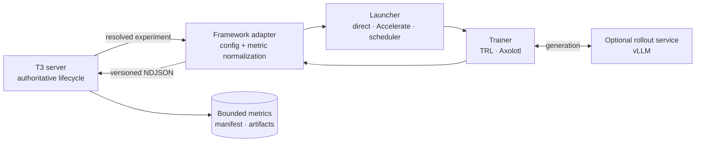

# RL framework adapters

T3RL is the control plane for a run; it is not another trainer. Framework integrations translate a
versioned experiment into a supervised process and normalize bounded evidence back into the existing
worker protocol. The run lifecycle, storage model, RPC surface, and clients remain independent of
TRL, Axolotl, or a distributed launcher.

## Compatibility model

Four concerns stay separate:

| Concern              | Examples                                             | Owner                                        |
| -------------------- | ---------------------------------------------------- | -------------------------------------------- |
| Trainer adapter      | Stable-Baselines3, native TRL, Axolotl               | Resolves config and normalizes native output |
| Process launcher     | Direct Python, Accelerate, `torchrun`, scheduler job | Starts and stops the topology                |
| Distributed strategy | FSDP, DeepSpeed ZeRO                                 | Trainer/launcher configuration               |
| Rollout engine       | Transformers generation, vLLM server                 | Adapter-managed process or sidecar           |

The adapter may supervise several backend processes, but the Node server still sees one run with one
terminal outcome. Partial rank failures, sidecar health, rendezvous errors, and scheduler job states
are translated into bounded logs, metrics, and the existing failure codes.

## Current status

| Backend                 | Status             | Current boundary                                                                      |
| ----------------------- | ------------------ | ------------------------------------------------------------------------------------- |
| Stable-Baselines3       | Implemented        | Direct local Python worker for control tasks                                          |
| Native TRL              | Implemented        | Single-process CUDA GRPO/RLVR, LoRA export, exact checkpoints, and holdout evaluation |
| Axolotl                 | Implemented        | Equivalent evidence through translated Axolotl/TRL configuration and callbacks        |
| Accelerate / `torchrun` | Planned launcher   | Launch ranks while exposing one worker protocol stream                                |
| FSDP / DeepSpeed        | Planned strategies | Remain framework configuration, never client lifecycle variants                       |
| vLLM                    | Planned sidecar    | Adapter owns readiness, GPU assignment, shutdown, and weight synchronization evidence |

Stable-Baselines3, native TRL, and Axolotl use independent committed `uv` projects. Their interpreters
are selected with `T3RL_PYTHON_STABLE_BASELINES3`, `T3RL_PYTHON_TRL`, and
`T3RL_PYTHON_AXOLOTL`, with `T3RL_PYTHON` retained only as a shared fallback. Capability resolution
runs `uv lock --check` when it finds project metadata beside the selected environment, never syncs
or installs, and records the lock digest plus runtime and accelerator evidence in the manifest.

Axolotl pins exact dependency versions, and no release accepts the TRL version the native adapter
targets, so it remains isolated from native TRL. Its GRPO documentation
presents a vLLM server as required; the schema defaults `use_vllm` to false and guards every vLLM
call behind it, so the first adapter runs single-GPU without a sidecar.

Axolotl's GRPO path builds on TRL and adds configuration and scaling features, so it should not
create a second metric vocabulary in T3RL. The adapter maps its output into the same `train/*`,
`eval/*`, and `system/*` namespaces used by the native TRL worker. See the official
[Axolotl GRPO guide](https://docs.axolotl.ai/docs/grpo.html),
[TRL GRPO metrics](https://huggingface.co/docs/trl/grpo_trainer), and
[Accelerate launcher guide](https://huggingface.co/docs/accelerate/quicktour).

## Checkpoint boundary

`checkpointing.py` is the trainer-neutral boundary. A Transformers-compatible callback turns a
completed native trainer save into one of four classes: `intermediate`, `best`, `final`, or
`graceful`. The shared publisher requires the PEFT adapter files and complete trainer state, writes
the dataset cursor, fsyncs the staged tree, and atomically renames it before emitting protocol v2
evidence. It separately calls the framework model's `save_pretrained` for a portable adapter export.

The native TRL adapter passes a verified directory to `Trainer.train(resume_from_checkpoint=...)`.
Its warm-start path loads the pinned base model and a trainable `PeftModel` instead. The Axolotl
adapter maps the same distinction to `resume_from_checkpoint` versus `lora_model_dir`, retains full
trainer state with `save_only_model: false`, and installs the same publication callback on the
resulting trainer. Neither adapter may silently fall back from exact resume to adapter loading.
Before measuring a resumed run's starting holdout, both adapters preload the checkpoint's model
weights; the later `train(resume_from_checkpoint=...)` call remains responsible for restoring the
optimizer, scheduler, RNG, cursor, and trainer state.

Long blocking trainer calls send explicit protocol-v2 `heartbeat` messages for liveness and
`resource` messages for `system/*` samples. Resource observations may join the bounded metric store;
heartbeats never masquerade as scientific training measurements.

The resolved policy records cadence, ready intermediate retention, whether to keep the final
checkpoint, and the graceful-cancellation deadline. `keepBest` is present in the contract but these
catalog experiments reject `true`: no best checkpoint is scientifically defined until an immutable
selection metric and direction are part of the experiment. Intermediate retention is server-owned,
so trainer cleanup behavior cannot make the UI claim that an unverified directory is resumable.

## Adapter obligations

Every adapter must:

1. Probe dependencies without installing or mutating the environment.
2. Resolve immutable model, dataset, tokenizer, reward, and source evidence before optimization.
3. Announce the same protocol version and runner identity expected by the server.
4. Keep human logs on stderr and reserve stdout for bounded NDJSON messages.
5. Normalize scalar telemetry into `train/*`, `eval/*`, and `system/*` keys.
6. Emit held-out evaluation separately from optimizer reward and retain its split policy.
7. Atomically publish artifacts below the run directory, then let the server stream-hash and mark
   them `ready`; worker-provided sizes or hashes are never authoritative.
8. Translate cancellation to the whole topology and report exactly one terminal result.
9. Record launcher, strategy, world size, rank topology, and rollout-engine evidence in the manifest.
10. Enforce token, wall-clock, artifact, and accelerator budgets before and during execution.
11. Refuse a configuration the backend cannot honour, rather than running a different one and
    letting the manifest claim a bound the run never applied.
12. Derive reported statistics from every scored sample, never from the bounded evidence
    excerpt, and divide that excerpt between phases so a long training phase cannot leave a
    run without post-training evidence.

## Delivery order

1. Prove the evaluation and telemetry contract with the native TRL adapter.
2. ~~Add checkpoint retention and resume semantics without changing the lifecycle model.~~ Done.
3. ~~Add an Axolotl adapter for one version-pinned GRPO configuration.~~ Done.
4. Add an Accelerate launcher with a deterministic two-GPU smoke fixture.
5. Add FSDP or DeepSpeed as strategies, then a separately supervised vLLM sidecar.

This order keeps failure attribution clear. Supporting every launcher and strategy at once would make
it impossible to distinguish a protocol defect from a trainer, collective, or rollout-service defect.
