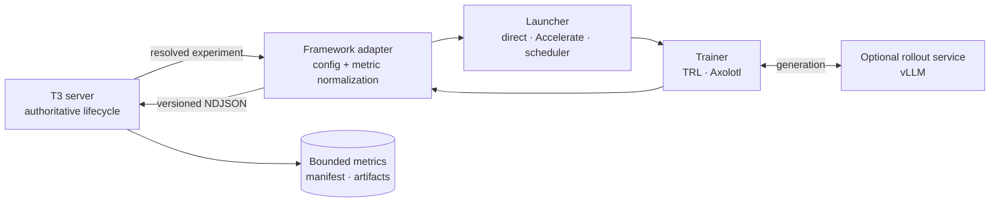

# RL framework adapters

T3RL is the control plane for a run; it is not another trainer. Framework integrations translate a
versioned experiment into a supervised process and normalize bounded evidence back into the existing
worker protocol. The run lifecycle, storage model, RPC surface, and clients remain independent of
TRL, Axolotl, or a distributed launcher.

## Compatibility model

Four concerns stay separate:

| Concern              | Examples                                             | Owner                                        |
| -------------------- | ---------------------------------------------------- | -------------------------------------------- |
| Trainer adapter      | Stable-Baselines3, native TRL, Axolotl               | Resolves config and normalizes native output |
| Process launcher     | Direct Python, Accelerate, `torchrun`, scheduler job | Starts and stops the topology                |
| Distributed strategy | FSDP, DeepSpeed ZeRO                                 | Trainer/launcher configuration               |
| Rollout engine       | Transformers generation, vLLM server                 | Adapter-managed process or sidecar           |

The adapter may supervise several backend processes, but the Node server still sees one run with one
terminal outcome. Partial rank failures, sidecar health, rendezvous errors, and scheduler job states
are translated into bounded logs, metrics, and the existing failure codes.

## Current status

| Backend                 | Status             | Current boundary                                                                      |
| ----------------------- | ------------------ | ------------------------------------------------------------------------------------- |
| Stable-Baselines3       | Implemented        | Direct local Python worker for control tasks                                          |
| Native TRL              | Implemented        | Single-process CUDA GRPO/RLVR with before/after holdout evaluation                    |
| Axolotl                 | Planned adapter    | Generate a run-scoped YAML, load approved reward plugins, and normalize trainer logs  |
| Accelerate / `torchrun` | Planned launcher   | Launch ranks while exposing one worker protocol stream                                |
| FSDP / DeepSpeed        | Planned strategies | Remain framework configuration, never client lifecycle variants                       |
| vLLM                    | Planned sidecar    | Adapter owns readiness, GPU assignment, shutdown, and weight synchronization evidence |

Axolotl's GRPO path builds on TRL and adds configuration and scaling features, so it should not
create a second metric vocabulary in T3RL. The adapter maps its output into the same `train/*`,
`eval/*`, and `system/*` namespaces used by the native TRL worker. See the official
[Axolotl GRPO guide](https://docs.axolotl.ai/docs/grpo.html),
[TRL GRPO metrics](https://huggingface.co/docs/trl/grpo_trainer), and
[Accelerate launcher guide](https://huggingface.co/docs/accelerate/quicktour).

## Adapter obligations

Every adapter must:

1. Probe dependencies without installing or mutating the environment.
2. Resolve immutable model, dataset, tokenizer, reward, and source evidence before optimization.
3. Announce the same protocol version and runner identity expected by the server.
4. Keep human logs on stderr and reserve stdout for bounded NDJSON messages.
5. Normalize scalar telemetry into `train/*`, `eval/*`, and `system/*` keys.
6. Emit held-out evaluation separately from optimizer reward and retain its split policy.
7. Write artifacts only below the run directory and announce them after the file is complete.
8. Translate cancellation to the whole topology and report exactly one terminal result.
9. Record launcher, strategy, world size, rank topology, and rollout-engine evidence in the manifest.
10. Enforce token, wall-clock, artifact, and accelerator budgets before and during execution.

## Delivery order

1. Prove the evaluation and telemetry contract with the native TRL adapter.
2. Add checkpoint retention and resume semantics without changing the lifecycle model.
3. Add an Axolotl adapter for one version-pinned GRPO configuration.
4. Add an Accelerate launcher with a deterministic two-GPU smoke fixture.
5. Add FSDP or DeepSpeed as strategies, then a separately supervised vLLM sidecar.

This order keeps failure attribution clear. Supporting every launcher and strategy at once would make
it impossible to distinguish a protocol defect from a trainer, collective, or rollout-service defect.
