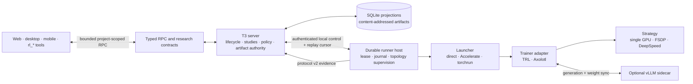
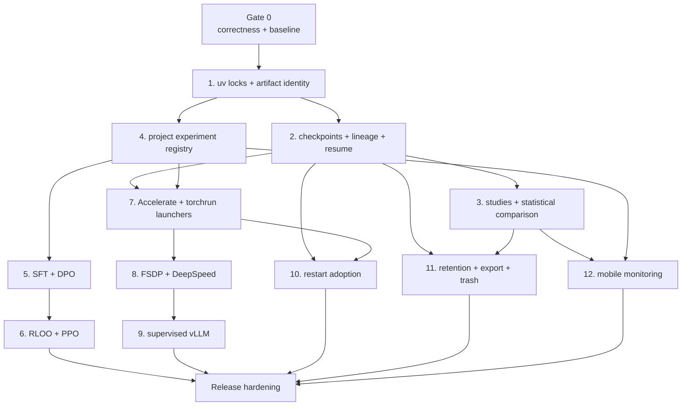

# Serious LLM post-training delivery plan

> For maintainers. This plan turns the remaining post-training work into ordered, reviewable
> increments. It is a dependency plan, not a calendar commitment.

**Status:** Proposed

**Goal:** Make T3RL a reproducible control plane for local and distributed LLM post-training with
TRL and Axolotl, while keeping the T3 server authoritative, Python workers replaceable, clients
backend-agnostic, and every scientific claim traceable to immutable evidence.

**Related architecture:**
[RL framework adapters](../../internals/rl-framework-adapters.md),
[RL Lab architecture](../../internals/rl-lab.md), and
[phased roadmap](../../internals/rl-lab-roadmap.md).

## Outcome

When this plan is complete, a researcher can define a versioned project experiment; run SFT, DPO,
GRPO, RLOO, or PPO; save a portable LoRA adapter and a resumable checkpoint; compare multiple seeds
with an explicit statistical method; scale the same experiment through Accelerate, FSDP, DeepSpeed,
and an optional supervised vLLM rollout service; survive a server restart; export or recoverably
delete the evidence; and monitor the run from web, desktop, mobile, or the project-scoped agent tools.

This plan deliberately does not turn T3RL into another trainer or cluster scheduler. Trainer,
launcher, distributed strategy, and rollout engine remain separate adapter concerns.

## Current baseline

The repository already has:

- an authoritative Node run lifecycle with SQLite projections and reconnectable subscriptions;
- a versioned NDJSON Python worker boundary;
- bundled Stable-Baselines3, native TRL GRPO/RLVR, and Axolotl GRPO adapters;
- bounded metrics and artifacts, capability probing, cancellation, and project-scoped agent tools;
- a web/desktop RL Lab with charts, manifest, evaluation, replay, and artifact access; and
- a shared client runtime that can support a future mobile surface.

The current boundary is still single-process and single-seed. Active runs become `interrupted` on
server restart, environments have upper dependency pins but no lockfiles, experiment definitions are
bundled rather than project-owned, and checkpoint identity, lineage, study aggregation, retention,
mobile UI, and formal performance gates are not yet implemented.

## Program rules

These apply to every increment:

1. **One public lifecycle.** TRL, Axolotl, Accelerate, FSDP, DeepSpeed, and vLLM do not become client
   lifecycle variants. Adapters normalize their behavior into the T3RL contracts.
2. **A resume creates a new run.** Completed or interrupted runs are immutable. The new run points to
   its parent and exact checkpoint, so history never changes underneath a result.
3. **A deployable adapter is not a resume checkpoint.** A LoRA adapter contains portable learned
   weights; exact continuation also needs optimizer, scheduler, scaler, RNG, trainer, and data-cursor
   state. The UI and contracts must never conflate them.
4. **Evidence is content-addressed.** The server computes hashes after a worker atomically publishes
   an artifact. Worker-provided hashes are hints, never authority.
5. **Definitions live in the project; outputs do not.** Versioned definitions may live below
   `.t3rl/`; run artifacts continue to live in T3 home, outside the working tree.
6. **No automatic environment mutation.** T3RL probes and reports setup commands. It never runs
   `uv sync`, installs CUDA packages, or changes an environment when starting a run.
7. **Agent parity.** Every new operation needed to run or inspect research gets a project-scoped
   `rl_*` agent utility backed by the same server service and authorization as the UI.
8. **Bounded by design.** Metric streams, snapshots, logs, artifact indexes, sidecar output, recovery
   journals, and mobile lists all have explicit limits and pagination.
9. **Scientific nulls remain nulls.** Missing, unsupported, non-finite, and measured zero stay
   distinguishable throughout worker, storage, RPC, aggregation, and visualization layers.
10. **Performance is an exit gate.** Each increment records its effect on CPU, RSS, SQLite writes,
    WebSocket bytes, artifact growth, and renderer work before it can graduate.

## Target architecture



The runner host is introduced only when restart adoption is implemented. Until then, the server
continues to supervise direct workers and safely resumes them as new runs from published checkpoints.

## Dependency map



Measurement work starts in Gate 0 and remains a gate for every later milestone; it is not postponed
until the end.

## Requested-scope coverage

| Requested capability                                       | Planned delivery           |
| ---------------------------------------------------------- | -------------------------- |
| Checkpoints/LoRA plus hashes                               | Milestones 1–2             |
| Explicit resume and lineage                                | Milestone 2                |
| Multi-seed uncertainty and paired comparison               | Milestone 3                |
| Project models, datasets, and verifiers                    | Milestone 4                |
| SFT, DPO, PPO, and RLOO beyond GRPO                        | Milestones 5–6             |
| Reproducible `uv` lockfiles                                | Milestone 1                |
| Accelerate/`torchrun`, then FSDP/DeepSpeed                 | Milestones 7–8             |
| Supervised vLLM sidecar                                    | Milestone 9                |
| Process adoption after restart                             | Milestone 10               |
| Retention, export, and recoverable deletion                | Milestone 11               |
| Real mobile RL surface                                     | Milestone 12               |
| CPU, memory, WebSocket, artifact, and renderer measurement | Gate 0 and every milestone |

## Contract and storage direction

Freeze these concepts before adding more trainers:

| Concept              | Required identity and meaning                                                              |
| -------------------- | ------------------------------------------------------------------------------------------ |
| Run                  | One execution attempt with immutable terminal history                                      |
| Study                | A declared set of comparable runs, seeds, and one evaluation protocol                      |
| Lineage edge         | Child run, parent run, exact checkpoint artifact, relation, and resume step                |
| Artifact             | Stable ID, role, media type, bytes, per-file hashes, root SHA-256, and ready/trash state   |
| Checkpoint           | Framework-specific resumable state; never assumed portable                                 |
| Adapter export       | Portable PEFT/LoRA weights plus base-model identity and adapter configuration              |
| Evaluation protocol  | Dataset/split fingerprint, sample IDs, generation seeds, decoding, verifier, and statistic |
| Execution topology   | Launcher, strategy, world size, ranks, GPU allocation, and sidecars                        |
| Environment evidence | Python version, runner versions, platform, and exact `uv.lock` digest                      |
| Lease                | Run host identity, authenticated control endpoint, journal cursor, heartbeat, and expiry   |

### Additive schema changes

Prefer additive migrations and backward-compatible readers:

- add `RlStudyId`, `RlCheckpointRef`, `RlLineage`, `RlExecutionTopology`,
  `RlEvaluationProtocol`, and `RlEnvironmentLock` contracts;
- extend artifact kinds with at least `config`, `checkpoint`, `adapter`, `dataset`, `source`, and
  `export`, and add `sha256`, `logicalName`, `format`, `state`, and optional checkpoint step;
- add typed manifest blocks for model revision, tokenizer revision, dataset fingerprint, verifier
  hash, train/data/evaluation/generation seeds, environment lock, and execution topology;
- keep `effectiveConfig` for exact backend configuration, but do not use it as a substitute for
  typed comparable evidence;
- add `rl_studies`, `rl_study_runs`, `rl_run_lineage`, and `rl_runner_leases` tables;
- add tombstone and export records without deleting current run rows in the first migration; and
- retain readers for protocol-v1 runs whose new evidence fields are legitimately unknown.

### RPC direction

Keep current RPCs and add narrow operations rather than expanding `rl.startRun` into a universal
command:

- `rl.validateExperiment` resolves a project definition without launching it;
- `rl.resumeRun` creates a child run from an exact checkpoint;
- `rl.createStudy`, `rl.getStudy`, and `rl.compareStudy` own multi-seed execution and results;
- `rl.queryMetrics` provides bounded ranges and resolutions instead of shipping full histories;
- `rl.listArtifacts` paginates checkpoint-heavy runs;
- `rl.exportRun` and `rl.exportStudy` stream evidence bundles outside WebSocket payloads; and
- `rl.trashRun`, `rl.restoreRun`, and `rl.purgeRun` implement the full reversible lifecycle.

Each operation gets the equivalent `rl_*` agent utility. The clients render server-owned state; they
do not calculate authoritative hashes, lineage, retention eligibility, or statistical conclusions.

### Worker protocol v2

Protocol v2 should add explicit `heartbeat`, `resource`, and checkpoint-publication evidence while
keeping metrics separate from lifecycle. The server supports v1 and v2 during migration, but every
new post-training capability requires v2. A v2 artifact is announced only after it is atomically
renamed into place; the server then validates confinement, size, contents, and hashes before marking
it ready.

## Gate 0: stabilize the existing LLM path and record the baseline

### Goal

Do not build persistence, statistics, or distributed execution on known ambiguous evidence.

### Deliverables

- Tighten the arithmetic verifier so embedded or exponent-like strings cannot satisfy an integer
  answer accidentally.
- Preserve every semantic training step when rate-limiting transport; never merge values from
  different steps under the newest step number.
- Bring Axolotl artifact kinds, LLM presentation, metric namespaces, heartbeat/resource telemetry,
  and error handling to parity with native TRL.
- Validate evaluation-batch divisibility and other trainer invariants before allocating a model.
- Make evaluation replay ordering deterministic and preserve stable sample IDs.
- Make a one-point metric series visibly render as a point and a multi-point series as a line; missing
  values get an explicit empty state rather than a flat zero.
- Fix stale documentation and targeted Python lint failures in the touched LLM workers.
- Add a repeatable fake-stream benchmark and record the first CPU, RSS, SQLite, WebSocket, artifact,
  and renderer baseline.

### Exit criteria

- Adversarial verifier fixtures such as embedded digits and scientific notation are rejected.
- A burst containing distinct steps persists and replays those steps without semantic coalescing.
- Native TRL and Axolotl expose the same metric meanings for the same GRPO experiment.
- The web/desktop chart visibly handles zero, one, and many samples without fabricating data.
- The baseline command, fixture, reference hardware, raw result, and summary are checked in.

### Verification

- Pure Python verifier and config tests.
- Worker protocol fixtures for native TRL and Axolotl.
- Focused manager/store tests driven by the fake spawner, without sleeps.
- Component tests for metric normalization and chart empty/single/multi-point states.
- One explicitly approved integrated web pass after the UI fix is implemented.

## Milestone 1: reproducible `uv` environments and artifact identity

### Goal

Make environment and artifact identity exact before checkpoints can become parents of future runs.

### Deliverables

- Replace ad hoc `.venv` setup with independent locked `uv` projects for SB3, TRL, and Axolotl. Keep
  them separate because their dependency constraints can legitimately conflict.
- Use a layout equivalent to:

  ```text
  python/environments/sb3/{pyproject.toml,uv.lock}
  python/environments/trl/{pyproject.toml,uv.lock}
  python/environments/axolotl/{pyproject.toml,uv.lock}
  ```

- Document `uv sync --project <environment> --locked` for setup and `uv lock --check` for CI. The
  app only probes the resulting interpreter.
- Record the selected lockfile path, SHA-256, Python executable, Python version, platform, CUDA,
  PyTorch, framework, and driver evidence in the resolved manifest.
- Hash files while streaming and hash directory artifacts through a canonical, sorted content
  manifest containing relative path, byte count, and per-file SHA-256.
- Publish through a temporary path and atomic rename, then let the server mark the artifact `ready`.
- Add bounded, paginated artifact listing before periodic checkpoints increase artifact count.

The `uv.lock` files are committed. This follows uv's model in which the lockfile records exact
resolved versions and `--locked` fails instead of silently changing it:
[uv lock and sync](https://docs.astral.sh/uv/concepts/projects/sync/) and
[uv project layout](https://docs.astral.sh/uv/concepts/projects/layout/).

### Exit criteria

- A clean machine can reproduce each supported interpreter using only its `pyproject.toml` and
  committed `uv.lock`.
- Capability probing reports a lock mismatch with an actionable command and makes no changes.
- Corrupting one artifact byte makes verification fail deterministically.
- Old artifacts remain readable with `sha256 = unknown`; only verified artifacts may be resume
  sources or exported as reproducible evidence.

## Milestone 2: LoRA exports, resumable checkpoints, and lineage

### Goal

Make interrupted and staged training explicit, reproducible, and auditable.

### Deliverables

- Add a trainer-neutral checkpoint callback boundary with framework adapters for TRL and Axolotl.
- Publish two distinct outputs:
  - a deployable LoRA/PEFT adapter, normally `adapter_model.safetensors` plus adapter config; and
  - a resumable checkpoint containing the state required by the selected trainer.
- Record base model ID and immutable revision, tokenizer revision, PEFT configuration, quantization,
  precision, trainable-module list, global step, tokens seen, dataset cursor, and framework version.
- Add checkpoint cadence, maximum retained intermediate checkpoints, keep-best, and keep-final policy
  to the resolved configuration.
- Implement `rl.resumeRun` as creation of a new child run after compatibility validation.
- Store a lineage edge from child to parent and exact checkpoint SHA-256; show the chain in web,
  desktop, and agent responses.
- Refuse exact resume when required trainer state is absent. Offer “start from adapter” as a distinct
  warm-start relation instead of silently degrading semantics.
- On cancellation or preemption, request a graceful final checkpoint within a declared deadline,
  then terminate the captured topology if the deadline expires.

PEFT adapter checkpoints intentionally contain only adapter parameters and still depend on the base
model; exact trainer continuation therefore needs separate state. See the official
[PEFT checkpoint format](https://huggingface.co/docs/peft/main/developer_guides/checkpoint) and
[Transformers resume behavior](https://huggingface.co/docs/transformers/main/trainer_recipes).

### Exit criteria

- A deterministic tiny-model fixture run uninterrupted and the same fixture resumed from step N
  reach equivalent final weights/metrics within a declared tolerance.
- An adapter can be loaded independently for inference when its pinned base model is available.
- Every checkpoint displayed as resumable has a verified hash and complete compatibility evidence.
- A completed parent never changes state or artifacts when its child runs, fails, or is deleted.

## Milestone 3: studies, multi-seed evaluation, and paired comparison

### Goal

Stop treating one run as a conclusion and make comparisons statistically honest.

### Deliverables

- Introduce a study as the unit that owns experiment A/B definitions, explicit seed sets, resource
  budget, and one immutable evaluation protocol.
- Separate training seed, data seed, evaluation sample seed, and generation seed in contracts.
- Give every evaluation item a stable sample ID; paired comparisons require identical protocol hash,
  sample IDs, and generation-seed policy.
- Persist per-run and per-sample evaluation results in bounded or artifact-backed form, not only an
  aggregate shown by the client.
- Implement versioned estimators for mean, median where relevant, dispersion, confidence interval,
  and paired delta. Record the statistical unit, resampling seed, resample count, missing-pair policy,
  and confidence level with every result.
- Make the default paired analysis hierarchical: resample independent run seeds, then paired samples
  within a seed when sample-level evidence exists. For insufficient N, show the raw runs and “not
  enough evidence” rather than manufacturing an interval.
- Add study scheduling with bounded concurrency and explicit partial/failure states.
- Add study comparison in web/desktop and equivalent `rl_*` evidence queries.

### Exit criteria

- Reordering arrivals or reconnecting a client cannot change an aggregate.
- A fixture with known paired deltas produces the same interval in server tests and exported output.
- The UI always shows N, seed set, aggregation method, interval, and unmatched/failed runs.
- Incompatible protocols cannot be presented as a paired result.
- Cancelling one member does not mislabel a partial study as complete.

## Milestone 4: project-owned experiments, datasets, models, and verifiers

### Goal

Let real projects define their post-training work without allowing clients to send arbitrary process
commands.

### Deliverables

- Add a versioned `.t3rl/experiments/*.json` schema with references to model, tokenizer, datasets,
  split policy, trainer method, verifier, evaluation protocol, budgets, and instrumentation.
- Support project-relative dataset and verifier paths plus pinned external IDs/revisions. Resolve and
  copy/hash the exact inputs into run evidence before the worker starts.
- Constrain every path to the project, reject symlink escapes, and keep entrypoint selection on a
  server-owned adapter allowlist.
- Load custom verifier code only inside the worker from the resolved immutable snapshot. Node never
  imports it and clients never provide a shell command.
- Add `rl.validateExperiment` with schema, dependency, model, dataset, verifier, capacity, and budget
  preflight. Validation returns warnings and errors without training or installing anything.
- Namespace bundled and project definitions and reject ambiguous IDs.
- Make the catalog refresh when committed definitions change without restarting the server.
- Expose validation, resolved hashes, and supported operations to the default project agent.

### Exit criteria

- Editing a definition or verifier after start cannot change the resolved run.
- Floating model/dataset revisions are rejected in reproducible mode and visibly marked in exploratory
  mode.
- A malicious relative path and symlink fixture cannot escape the project or artifact root.
- One project-defined TRL experiment and one Axolotl experiment pass the same lifecycle and evidence
  contract without modifying bundled worker source.

## Milestone 5: SFT and DPO

### Goal

Cover the two foundational offline stages before adding more online RL complexity.

### Deliverables

- Add a method capability contract rather than assuming every runner accepts GRPO fields.
- Add typed dataset adapters:
  - SFT: text or conversational prompt/completion records with chat-template evidence;
  - DPO: prompt, chosen response, and rejected response with preference-policy evidence.
- Implement native TRL SFT and DPO adapters first, including LoRA, checkpoints, resume, evaluation,
  and normalized metrics.
- Translate the same project schema into supported Axolotl SFT/DPO configurations rather than
  creating an Axolotl-specific public schema.
- Define method-specific evaluation defaults but require the project to select the claim it wants to
  measure; training loss alone is not an evaluation result.
- Add tiny deterministic CPU fixtures and separately gated single-GPU smoke tests.

TRL currently exposes SFT, DPO, GRPO, RLOO, and other trainers behind one library surface, which
makes it a practical canonical adapter boundary:
[TRL trainer taxonomy](https://huggingface.co/docs/trl/main/en/index).

### Exit criteria

- The same resolved model/dataset evidence is visible across SFT, DPO, and GRPO runs.
- SFT output can be selected explicitly as DPO input through a lineage relation.
- DPO rejects malformed or unpaired preference records before model allocation.
- Native TRL and Axolotl either honor a declared option or report it unsupported; neither silently
  substitutes another behavior.

## Milestone 6: RLOO, then PPO

### Goal

Complete the main online post-training family without hiding algorithm-specific requirements.

### Delivery order

1. **RLOO** reuses much of the generation/reward path already exercised by GRPO and has fewer moving
   pieces than a full PPO stack.
2. **PPO** follows only after reward/reference/value model identities and their memory budgets are
   represented explicitly.

### Deliverables

- Add RLOO configuration, reward/verifier plumbing, metrics, checkpointing, and evaluation through
  the native TRL adapter.
- Add PPO identities for policy, reference policy, reward model/verifier, and value model; never hide
  these as unnamed implementation details.
- Record rollout batch, optimization epochs, KL controller, clipping, advantage estimation, and
  reward normalization in typed comparable evidence.
- Normalize shared metrics while retaining method-specific namespaces for algorithm diagnostics.
- Add incompatibility matrices per TRL/Axolotl version instead of claiming feature parity where it
  does not exist.
- Require an evaluation protocol independent from the optimization reward for public comparisons.

### Exit criteria

- Tiny RLOO and PPO fixtures complete, cancel, checkpoint, and resume through protocol v2.
- Reward-model or verifier failure cannot be reported as zero reward.
- Model memory preflight accounts for every resident model and refuses an impossible topology before
  allocation.
- The clients remain driven by capabilities and do not branch on framework names.

## Milestone 7: Accelerate and `torchrun` launchers

### Goal

Make process topology replaceable before introducing distributed state formats.

### Deliverables

- Extract a `ProcessLauncher` boundary from trainer adapters with direct, Accelerate, and `torchrun`
  implementations.
- Resolve GPU IDs, world size, rendezvous, ports, mixed precision, and launcher config into the
  manifest before spawn.
- Reserve resources server-side so two runs cannot accidentally claim the same local GPUs.
- Allow only rank zero to emit the worker protocol; capture bounded per-rank logs and attribute rank
  failures without multiplying metric streams.
- Cancel the captured process topology by identity and wait on receipts, never by name matching.
- Provide a deterministic multi-rank fake fixture and a separately gated two-GPU smoke test.
- Keep multi-node placement delegated to an existing scheduler; a launcher adapter records its job ID
  but T3RL does not implement cluster scheduling.

Accelerate supports its own launcher as well as `torchrun`, while multi-node launches need
coordination on every node or an external scheduler. See the official
[Accelerate launch guide](https://huggingface.co/docs/accelerate/main/basic_tutorials/launch).

### Exit criteria

- One experiment runs through direct and two-rank launchers with the same public run contract.
- A nonzero exit from any required rank fails the run exactly once with rank evidence.
- Cancellation leaves no child owned by the recorded topology.
- Client code contains no Accelerate or `torchrun` lifecycle branch.

## Milestone 8: FSDP, then DeepSpeed

### Goal

Scale model state while preserving portable outputs and exact distributed resume.

### Delivery order

1. **FSDP first:** it keeps the first strategy within the PyTorch/Transformers/Accelerate stack.
2. **DeepSpeed second:** add ZeRO only after topology, failure, and checkpoint semantics are proven.

### Deliverables

- Add a typed distributed-strategy block with strategy version, sharding mode/stage, offload,
  precision, wrapping policy, activation checkpointing, and effective configuration hash.
- Publish strategy-native sharded resume checkpoints plus a portable merged LoRA adapter from rank
  zero.
- Validate world-size and strategy compatibility before resume. A portable adapter may move between
  topologies; a sharded resume checkpoint may not unless the adapter explicitly supports conversion.
- Add FSDP checkpoint merge/validation in a controlled post-processing step with its own resource
  budget and artifact evidence.
- Add DeepSpeed ZeRO stages incrementally, beginning with the smallest configuration required by a
  reference model.
- Classify collective, rendezvous, out-of-memory, checkpoint, and rank-divergence failures.

Accelerate documents both FSDP configuration and DeepSpeed launch integration, including sharded
weight handling:
[Accelerate FSDP](https://huggingface.co/docs/accelerate/package_reference/fsdp) and
[Accelerate DeepSpeed](https://huggingface.co/docs/accelerate/usage_guides/deepspeed).

### Exit criteria

- A two-GPU reference run checkpoints, resumes, exports a portable adapter, and evaluates.
- Distributed and single-GPU runs with the same evaluation protocol remain comparable.
- Missing or partial shards are detected before resume.
- Peak memory, throughput, checkpoint time, and merge cost are attached to the run evidence.

## Milestone 9: supervised vLLM rollout sidecar

### Goal

Accelerate online rollouts without turning vLLM into an unmanaged external prerequisite.

### Deliverables

- Add a `RolloutEngine` boundary with Transformers generation and vLLM server implementations.
- Let the run topology owner start vLLM on an allocated device set, bind it locally, capture its exact
  process identity, wait for readiness, monitor health, and stop it with the run.
- Record vLLM version, arguments, model revision, GPU allocation, endpoint scope, readiness time,
  weight-sync mode, last synchronized step, and sleep-mode use.
- Keep the vLLM endpoint private to the worker topology; clients receive state and evidence, not
  direct service credentials.
- Treat readiness, generation, weight transfer, NCCL, and stale-weight failures as distinct bounded
  run errors.
- Support server mode first because the requested product behavior is a supervised sidecar. Add
  colocated mode later only if measurement shows it is useful.

TRL supports both colocated and server-mode vLLM; server mode uses a separate process and can require
dedicated GPU resources and explicit weight synchronization. See the official
[TRL vLLM integration](https://huggingface.co/docs/trl/vllm_integration).

### Exit criteria

- Killing the sidecar makes the run fail or recover according to declared policy; it never hangs
  silently or continues with stale weights.
- Cancelling the run stops trainer ranks and sidecar using captured identities.
- A/B evidence shows rollout throughput, GPU memory, synchronization cost, and end-to-end step time
  against Transformers generation.
- No vLLM-specific lifecycle leaks into web, desktop, mobile, or agent tools.

## Milestone 10: process adoption after a server restart

### Goal

Reconnect to live work safely instead of guessing from a PID or immediately interrupting every run.

### Decision

Do not “adopt” an arbitrary process by PID. A restarted Node process cannot safely recover stdout,
identity, or topology from an orphan. Introduce a small durable runner host that owns the trainer and
sidecars, exposes an authenticated local Unix socket, and keeps a bounded cursor-addressed journal.

### Deliverables

- Persist a lease containing run ID, runner-host version, socket path, random credential reference,
  process start identity, topology IDs, last durable journal cursor, heartbeat, and expiry.
- On startup, reconcile each active run:
  1. authenticate and reconnect to its known runner host;
  2. replay journal entries after the stored cursor;
  3. continue the existing run if identity and manifest match;
  4. otherwise mark it interrupted and offer checkpoint resume as a new child run.
- Separate run lifecycle from control connection health; a temporary server disconnect does not
  rewrite `running` to a fictional state.
- Make the host own graceful checkpoint-on-termination and the complete process topology.
- Bound journal bytes and compact only after the server durably acknowledges a cursor.
- Support scheduler-job recovery through durable job IDs at the launcher boundary.
- Refuse adoption across incompatible host/protocol versions and provide an explicit recovery reason.

### Exit criteria

- Restarting the Node server during a fake long run reconnects without losing or duplicating evidence.
- Restarting during checkpoint publication yields either one verified checkpoint or one incomplete
  artifact that cannot be resumed.
- Forged/stale leases and PID reuse fixtures are rejected.
- A runner host that cannot be reached leads to an honest interrupted run, never false completion.
- Recovery journals remain bounded during a declared maximum disconnection window.

## Milestone 11: retention, export, and recoverable deletion

### Goal

Control storage growth without destroying lineage or making results impossible to audit.

### Deliverables

- Add environment and project policies for artifact quota, checkpoint cadence, keep-last, keep-best,
  keep-final, study baselines, and trash TTL.
- Compute actual bytes from verified artifacts; references to shared content count according to a
  documented logical/physical policy.
- Export a run or study as a streamed research bundle containing a schema-versioned index, manifests,
  definitions, environment lock digests, lineage, evaluation protocol, aggregates, selected metrics,
  artifact hashes, and verification command. Exclude credentials and secret environment values.
- Implement `ready -> trashed -> purged` for artifacts/runs with visible restoration before TTL.
- Block or explicitly cascade purge when descendants, studies, exports, or pinned baselines reference
  unique evidence.
- Keep metadata tombstones after byte purge so history can say what was removed, when, by which
  policy/action, and whether it was exported first.
- Run cleanup through bounded jobs with receipts; never recursively delete a broad unresolved path.

### Exit criteria

- Export verification detects a changed or missing byte and works without the originating database.
- Trash removes bytes from normal views, restore returns them before TTL, and purge is explicit.
- A retention dry run explains exactly what would be removed and why.
- A checkpoint referenced by live lineage cannot disappear through an unrelated quota sweep.
- Repeated cleanup is idempotent and cannot cross run or project boundaries.

## Milestone 12: real mobile monitoring and control

### Goal

Make long-running post-training observable remotely without squeezing desktop authoring into a small
screen.

### First mobile surface

- environment/project selector and capability summary;
- active/recent run and study list with lifecycle and resource state;
- compact reward, evaluation, KL, loss, throughput, and memory charts using bounded range queries;
- checkpoint/adapter/export metadata and lineage summary;
- bounded log tail and actionable errors;
- reconnect state and last-authoritative-update time; and
- safe cancellation with confirmation.

Experiment authoring, verifier editing, distributed topology editing, and destructive purge remain
web/desktop operations until the monitoring surface is proven.

### Deliverables

- Move remaining reusable selectors, subscription state, metric downsampling, and capability helpers
  into `packages/client-runtime` without introducing DOM or React Native dependencies.
- Add an RL Lab route/navigation entry in the iOS and Android app.
- Paginate history and artifacts and virtualize lists; backgrounding must not retain an unbounded
  metric stream.
- Resume subscriptions from a cursor when possible and fall back to a bounded authoritative snapshot.
- Make local, LAN, relay, and tunnel connections use the same authorization and RPCs.
- Add accessible chart summaries so a graph is not the only representation of a result.

### Exit criteria

- A mobile client can reconnect, inspect, and cancel a run executing on another environment.
- Background/foreground cycles do not cancel the run, duplicate metrics, or grow memory without bound.
- The same run/study identifiers and values appear on web, desktop, and mobile.
- iOS and Android have focused state tests and, with explicit approval, one integrated simulator or
  emulator pass through the repository mobile testing workflow.

## Cross-cutting performance and reliability gates

Gate 0 creates the harness. Every later milestone reruns the relevant profile and attaches its delta
to the implementation review.

### Workload profiles

| Profile                               | Purpose                                           |
| ------------------------------------- | ------------------------------------------------- |
| 1 run, 30 minutes, 2 metric batches/s | Detect leaks and idle renderer work               |
| 8 active runs, mixed subscribers      | Normal workstation/server behavior                |
| 32 fake active runs, reconnect storm  | Backpressure, SQLite, and WebSocket bounds        |
| Checkpoint-heavy run                  | Hashing, indexing, retention, and export behavior |
| Two-rank + sidecar failure matrix     | Topology cancellation and failure attribution     |
| 200 historical runs on mobile         | Pagination, virtualization, and memory behavior   |

### Measurements

- server CPU time, event-loop delay, RSS/heap, worker-host RSS, and per-process accelerator memory;
- metric input rate, stored rows, SQLite transaction duration, database/WAL growth, and compaction;
- WebSocket messages/bytes per run, initial subscription bytes, reconnect replay bytes, and dropped or
  coalesced transport updates;
- artifact logical/physical bytes, hash time, checkpoint pause time, export throughput, and trash
  reclamation;
- web/desktop render commits, long tasks, idle repaint rate, chart point count, and interaction P95;
- mobile JS/native memory, list mount time, background subscription behavior, and interaction P95; and
- training tokens/s, rollout tokens/s, step latency, GPU-hours allocated, and overhead introduced by
  T3RL instrumentation.

### Provisional budgets to freeze after Gate 0

- Keep the existing maximum of two live metric publications per second per run; rate limiting may
  delay display but may not merge different semantic steps.
- Default initial subscription payload stays below 256 KiB; older metrics and artifacts use bounded
  range/pagination APIs.
- No continuously repainting UI when authoritative state is idle.
- Reference charts keep interaction/render P95 below one 60 Hz frame on the declared reference
  workstation, or document a measured lower supported point count.
- The 30-minute steady-state profile has no statistically meaningful positive memory slope after
  warm-up and no more than a 10% CPU/RSS regression from the accepted baseline without an explicit
  trade-off record.
- Every run has enforced wall-time, accelerator-time, generated-token, artifact-byte, log-byte, and
  checkpoint-count limits owned by the server.

The numeric budgets are provisional because the repository has not yet recorded its formal baseline.
Gate 0 must replace them with measured supported values rather than weakening a gate after a feature
misses it.

## Test strategy

### Pyramid

1. **Pure contract/domain tests:** schemas, lineage rules, hash manifests, compatibility, statistics,
   retention decisions, range aggregation, and topology state machines.
2. **Component tests:** stores, artifact publication, experiment resolution, launchers, runner-host
   reconnect, exports, and client-runtime reducers using fakes and in-memory state.
3. **Process integration tests:** deterministic fake workers/ranks/sidecars for success, failure,
   cancellation, partial writes, restart, reconnect, and backpressure.
4. **Gated framework tests:** tiny SB3/TRL/Axolotl CPU tests, then explicitly gated one-GPU and two-GPU
   smoke tests. These never gate an ordinary developer without the required hardware.
5. **Integrated client passes:** one primary-agent pass for affected web or mobile surfaces after
   explicit permission, plus remote reconnect coverage when transport behavior changes.

### Coverage targets

- 100% decision-branch coverage for lifecycle transitions, path confinement, hash verification,
  resume compatibility, lineage deletion guards, and retention eligibility.
- At least 90% line and branch coverage for new store, launcher, runner-host, and statistical modules.
- At least 90% reducer/selector coverage for new web/mobile shared runtime logic.
- Real framework smoke tests prove integration, not exhaustive parameter coverage; schema and fake
  tests own the combinatorial matrix.

### Mandatory failure cases

- corrupt/missing checkpoint file, wrong base revision, wrong lock digest, and incomplete publication;
- malformed verifier/dataset, project path escape, stale project snapshot, and unsupported option;
- rank failure, rendezvous timeout, OOM, sidecar death, stale weights, and cancellation during sync;
- server restart during training, metrics, checkpoint, export, trash, and purge;
- duplicate request/replay cursor, out-of-order metrics, partial study, and unmatched evaluation pair;
- slow subscriber, reconnect storm, full quota, export disconnect, and mobile backgrounding.

## Release checkpoints

### Release A: trustworthy local post-training

Includes Gate 0 and Milestones 1–4. It is complete when locked environments, verified artifacts,
LoRA/checkpoint distinction, resume lineage, multi-seed studies, and project definitions work for the
existing GRPO path.

### Release B: training breadth

Includes Milestones 5–6. It is complete when SFT, DPO, GRPO, RLOO, and PPO advertise honest
capabilities and share the same evidence, checkpoint, evaluation, and lineage contracts.

### Release C: scale and resilience

Includes Milestones 7–10. It is complete when a two-GPU run can launch, checkpoint, resume, use an
optional supervised vLLM sidecar, and survive a server restart without framework concepts leaking
into clients.

### Release D: operable product

Includes Milestones 11–12 and final hardening. It is complete when storage is controllable and
recoverable, research bundles verify independently, mobile monitoring works remotely, migrations read
old runs, and every declared performance budget passes.

## Recommended first implementation slice

Start with a narrow two-part slice:

1. **Gate 0 correctness:** fix verifier boundaries, step-preserving metrics, Axolotl contract parity,
   replay order, preflight validation, and zero/one/many-point chart states; record the baseline.
2. **Milestone 1 environment evidence:** create the three independent `uv` projects and lockfiles,
   add artifact SHA-256/state fields with backward-compatible readers, and prove atomic publication
   with fake-worker tests.

Do not begin distributed launchers in the same slice. The first review should answer two binary
questions: “Can we trust each recorded metric/artifact?” and “Can another machine reconstruct the
environment that produced it?”

## Whole-program definition of done

- All twelve requested capabilities satisfy their milestone exit criteria.
- Existing protocol-v1 and unhashed runs remain readable and are visibly marked as legacy evidence.
- Web, desktop, mobile, and agent utilities agree on authoritative identifiers and lifecycle state.
- TRL/Axolotl/backend differences stay behind capability, trainer, launcher, strategy, and rollout
  adapters.
- A documented case study performs SFT -> DPO or GRPO/RLOO -> multi-seed evaluation, resumes from a
  checkpoint, scales to two GPUs, exports a verified bundle, and can be monitored remotely.
- Targeted tests, gated GPU tests, migrations, rollback/read compatibility, security review, and
  performance budgets pass before the feature set is described as serious post-training support.
